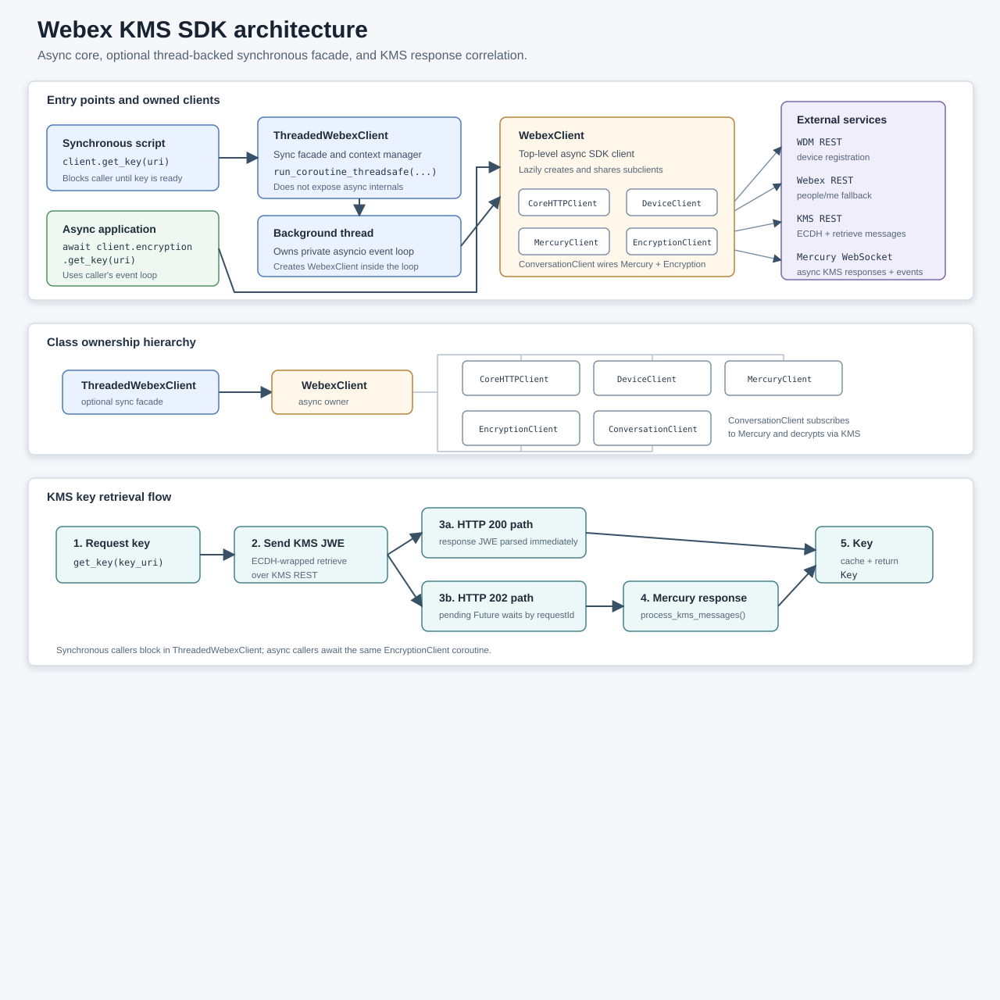
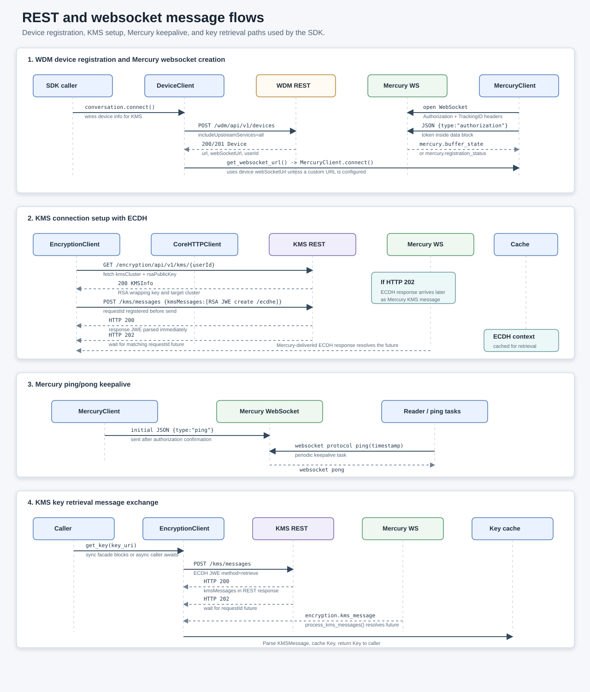

# Webex KMS SDK

Async Python SDK slice for Webex Mercury communication and KMS-backed message decryption, with
an optional thread-backed synchronous facade for scripts.

Based on https://github.com/WebexCommunity/webex-go-sdk, this package provides a focused implementation of the Webex Mercury protocol and KMS interactions needed for E2EE message decryption and conversation activity handling. It is designed to be used in conjunction with other Webex SDK components or as a standalone library for applications that need to interact with Webex conversations and messages.

This package intentionally covers a narrow part of the Webex Go SDK behavior:

- WDM device registration needed for Mercury
- Mercury WebSocket connection and event dispatch
- KMS ECDH setup, key retrieval, async Mercury response correlation, and key caching
- JWE text decryption and lightweight conversation activity helpers
- Thread-backed synchronous key retrieval for non-async scripts

It does not implement the full Webex REST API, WebRTC calling, outbound E2EE message encryption,
or KMS administration.

## Architecture



`WebexClient` is the async owner for the SDK sub-clients. `ThreadedWebexClient` is an optional
synchronous facade that runs the async client on a private background event loop and delegates KMS
operations to the same `EncryptionClient` implementation.



The message flow diagram shows the REST calls and websocket messages used for WDM registration,
Mercury authorization and keepalive, KMS ECDH setup, and KMS key retrieval.

## Install

```bash
pip install webex-kms-sdk
```

For local development:

```bash
uv sync --group dev
```

## Async Quick Example

```python
import asyncio
import os

from webex_kms_sdk import WebexClient


async def main() -> None:
    client = WebexClient(os.environ["WEBEX_ACCESS_TOKEN"])
    conversation = client.conversation

    async def on_post(activity):
        content = await conversation.get_message_content(activity)
        print(content)

    conversation.on("post", on_post)
    await conversation.connect()

    try:
        await asyncio.Event().wait()
    finally:
        await conversation.disconnect()
        await client.aclose()


asyncio.run(main())
```

## Threaded Synchronous Example

Use `ThreadedWebexClient` when caller code is synchronous but KMS responses may still arrive
asynchronously over Mercury. The client starts an event loop and Mercury connection in a background
thread, then blocking methods such as `get_key()` wait for completion.

```python
import os

from webex_kms_sdk import ThreadedWebexClient


with ThreadedWebexClient(os.environ["WEBEX_ACCESS_TOKEN"]) as client:
    key = client.get_key(os.environ["KMS_KEY_URI"])

print(f"Retrieved key {key.uri}")
```

For a runnable script, see `examples/threaded_get_key.py`.
